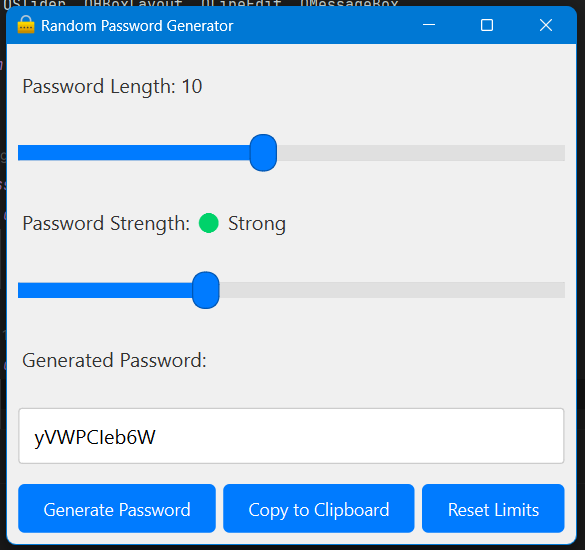

# Python-Password-Generator


A simple yet powerful Random Password Generator application built using Python and PyQt6. This application allows users to generate passwords with customizable lengths and strengths, and provides options to copy the generated password to the clipboard.

## Features

- **Password Generation**: Generate random passwords with various strengths (Weak, Medium, Strong, Very Strong).
- **Customizable Length**: Set password length from 6 to 15 characters using a slider.
- **Password Strength**: Adjust the password strength using a slider with levels from Weak to Very Strong.
- **Copy to Clipboard**: Easily copy the generated password to the clipboard with a single button click.
- **Reset Limits**: Reset the password length and strength to default values.
- **Professional Styling**: Clean and modern user interface styled with CSS.

## Installation

To run this application, you need to have Python 3 and PyQt6 installed. You can install the required dependencies using pip.

1. **Clone the Repository**:

   ```bash
   git clone https://github.com/BehzadHassan/Python-Password-Generator.git
   ```

2. **Navigate to the Project Directory**:

   ```bash
   cd Python-Password-Generator
   ```

3. **Install the Required Packages**:

   ```bash
   pip install PyQt6
   ```

4. **Run the Application**:

   ```bash
   python password_generator.py
   ```


## Usage

1. **Set Password Length**: Use the length slider to adjust the desired password length between 6 and 15 characters.

2. **Set Password Strength**: Use the strength slider to select the desired password strength. The options are:
  - **Weak**: Only lowercase letters.
  - **Medium**: Lowercase letters and numbers.
  - **Strong**: Lowercase letters, numbers, and special characters.
  - **Very Strong**: All of the above plus additional special characters.

3. **Generate Password**: Click the "Generate Password" button to create a new random password based on the current settings.

4. **Copy to Clipboard**: Click the "Copy to Clipboard" button to copy the generated password to your clipboard.

5. **Reset Limits**: Click the "Reset Limits" button to reset the sliders to their default values.

## Screenshots

### Main Window



## Contributing

Contributions are welcome! If you have any suggestions, improvements, or bug reports, please feel free to submit a pull request or open an issue.

## Acknowledgements

- **PyQt6**: For providing the tools to create the graphical user interface.
- **Python**: For being the versatile programming language used in this project.
